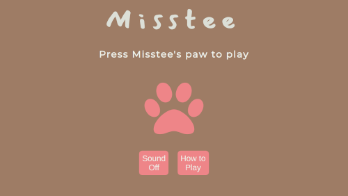

# Misstee 


## Description
After learning a bit on how to work with HTML ``` <canvas> ``` and playing with it, I decided to venture into making my own game! It takes inspiration from our lovely and sweet one ear cat Misstee and her love for shrimps.

## Built with
- HTML
- CSS 
- Javascript. 

## Reflection

I enjoyed so much building this game and in the process I've learnt how to work with html canvas to create a game, namely:
- how draw elements
- animating elements
- managing all collisions between elements.

## Demo




